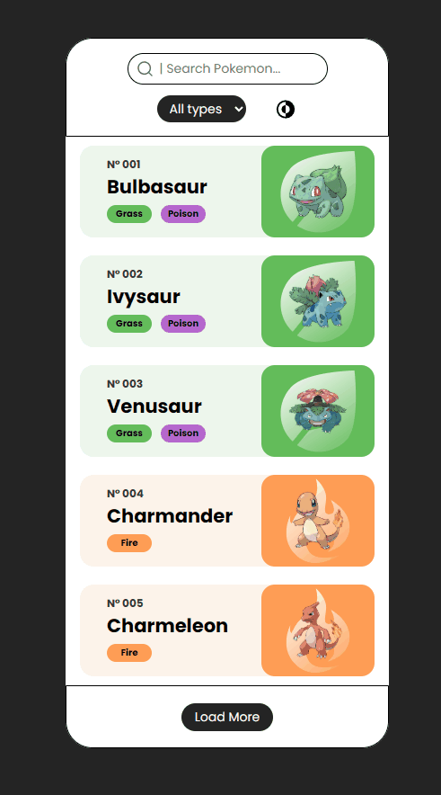

# Pokedex - React App 🐾

My first project built with **React**! This is a **Pokedex** app that allows users to search for Pokémon, view their details, and filter them by type. The project uses **React Router** for navigation, **Axios** for API calls, and features a **theme toggle** for light/dark mode.

🔗 **Live Preview:**  
👉 [Click here to visit the site](#)

---

## 🚀 Technologies Used

- **React** – The core library for building the user interface.
- **React Router** – For routing and navigation between pages.
- **Axios** – To make API requests and fetch Pokémon data.
- **Styled-Components** – For writing scoped, dynamic, and reusable styles in JavaScript.
- **CSS** – For styling and creating the responsive layout.

---

## 🌟 Features

- **Search Input**: Search for any Pokémon by name.
- **Theme Toggle**: Switch between light and dark modes.
- **Filters**: Filter Pokémon by type (Fire, Water, Grass, etc.).
- **React Router**: Smooth navigation between different pages (e.g., Home, Pokémon Details).
- **API Integration**: Uses the [Pokémon API](https://pokeapi.co/) to fetch live data.

---

### 💻 Design Preview



---

## 🛠️ Getting Started

To run the project locally:

1. Clone the repository:
   ```bash
   git clone https://github.com/yourusername/Pokedex.git
   ```
2. Navigate to the project folder:
   ```bash
   cd Pokedex
   ```
3. Install dependencies:

```bash
npm install
```

4. Run the APP

```bash
npm run dev
```

# 💡 Lessons Learned

While working on this project, I identified a few areas that needed improvement:

Component Organization: Initially, the components were somewhat scattered, which made the code harder to maintain. I learned the importance of organizing components into smaller, reusable pieces.

Routing Structure: I had to rethink the routing structure and improve the way I handled navigation between pages. It made me realize how important it is to plan out the app’s architecture from the beginning.

This project helped me better understand React, React Router, and Axios, and gave me a deeper appreciation for organizing code effectively.
